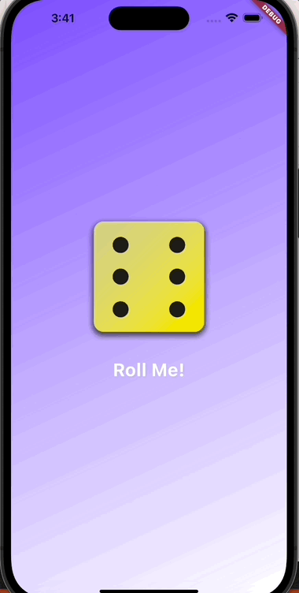

# 🎲 DiceRoller App

This is a simple Flutter app that demonstrates the basic concepts of the Flutter framework and the Dart programming language. It allows you to roll virtual dice with just a tap!

## Features

- Tap the screen to roll a pair of dice.
- Experience the ease of Flutter for building interactive mobile applications.
- Get a hands-on introduction to Dart, the language used in Flutter development.

## Getting Started

To get started with this app, make sure you have Flutter installed on your system. If not, you can follow the official Flutter installation guide [here](https://flutter.dev/docs/get-started/install).

1. Clone this repository to your local machine:

```bash
git clone https://github.com/yourusername/DiceRoller.git
```
2. Navigate to the project directory:
```bash
cd flutter_dice_roller
```
3. Run the app on your preferred emulator or device:
```bash
flutter run
```
## Screenshots


## Author
Main maintainer: Mo Bamoh